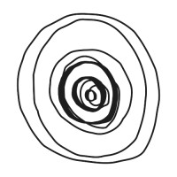

<h1>Adrian Llopart, PhD</h1>

(+45) 50285750 &bull; adrianllopart@gmail.com &bull; Copenhagen, Denmark 
<a href="https://adrianllopart.github.io">https://adrianllopart.github.io</a>

Robotics PhD and senior AI engineer building and deploying VLA systems for real-world robots. Experience with robotic foundation models, imitation learning, generative policies, simulation-to-real evaluation, multimodal perception, autonomy and GPU-accelerated edge deployment.

# Professional Experience

Founder OpenRAL

Copenhagen, Denmark Jul 2026 - Present

- Founded **OpenRAL**, an open-source, ROS 2-native runtime for developing, evaluating and deploying VLA-based robot skills across real hardware and simulation ([github.com/OpenRAL/openral](https://github.com/OpenRAL/openral)).
- Integrated VLA and policy families including Pi0.5, NVIDIA GR00T N1.7, LingBot-VLA, xVLA, RLDX-1, SmolVLA, ACT and diffusion policies with typed robot interfaces, benchmarking, observability and deployment tooling.
- Built embodied-AI infrastructure spanning VLMs, open-vocabulary detection, monocular depth, visual SLAM, 3D world state, Nav2, MoveIt/cuMotion planning and C++ collision-aware safety enforcement.
- Built reproducible workflows across Gazebo, MuJoCo and Isaac Sim, including LIBERO, RoboCasa and BEHAVIOR-1K benchmarks.

Senior Robotics and AI Engineer Qualia

Copenhagen, Denmark 2026 - Present

- Built a demonstration-data pipeline that retargets egocentric human video to UMI-gripper and robot actions for OpenArm and Flexiv, including cleaning and data augmentation.
- Trained and evaluated Pi0.5 and NVIDIA GR00T N1.7 robot policies using behavior cloning, DAgger and flow matching; validated two real-robot tasks from initial curated human demonstrations.
- Deployed and optimized robot policies for real-time inference across NVIDIA Jetson platforms, with ongoing work on a GStreamer/NVMM pipeline to minimize end-to-end processing overhead.

Senior Machine Learning Engineer Jabra GN

Copenhagen, Denmark Aug 2024 - Present

- Deployed multimodal deep learning models for real-time visual tracking and speech diarization on edge devices powering videobars for meeting rooms.
- Built the team's MLOps stack from scratch: data versioning, model training orchestration, deployment and monitoring.
- Built the generative Video + Audio data pipeline for synthetic multimodal data generation and annotation.

CEO &amp; Co-Founder MederiAI

Copenhagen, Denmark Feb 2024 - Aug 2026

- Led development of a spatio-temporal vision AI platform that detects gastrointestinal lesions in video-capsule endoscopy footage, cutting clinician review time from ~2 hours to ~15 minutes while lowering missed-lesion rates.
- Raised 300k&euro; in pre-seed funding; led a team of full-stack engineers across UI/UX, frontend, backend, AWS infrastructure and AI pipelines.

Senior Machine Learning Researcher Veo Technologies

Copenhagen, Denmark Jan 2021 - May 2024

- Shipped production deep learning models to cloud and edge devices for automated sports capture: 2D/3D player and ball detection and tracking from monocular video, plus action recognition and localization.
- Owned the full model lifecycle — data collection, annotation, architecture design, training, optimization and deployment — using PyTorch, TensorRT, AWS and GStreamer.
- Co-developed AI-driven advanced match analytics, including the UX/UI of the user-facing product.

Senior AI Algorithms Developer Huawei

London, United Kingdom Jan 2019 - Jan 2021

- Re-implemented and improved state-of-the-art deep learning methods in TensorFlow and PyTorch for object recognition, detection and segmentation, and human action recognition and detection.
- Developed LiftFormer, a transformer-based 3D human pose estimation model achieving state-of-the-art results on Human3.6M and HumanEva-I with fewer parameters than prior methods.
- Supervised intern research projects.

Supervisor of Master Theses Technical University of Denmark (DTU)

Lyngby, Denmark Feb 2017/18 - Jul 2017/18

- Supervised five MSc theses on robot motion planning, mobile-robot obstacle avoidance with RNNs and CNN transfer learning; several were presented at international conferences.

# Publications

- **Liftformer: 3D human pose estimation using attention models**, ArXiv preprint: *arXiv:2009.00348*, September 2020, UK.
- **Online Semantic Segmentation and Manipulation of Objects in Task Intelligence for Service Robots**, International Conference on Control, Automation, Robotics and Vision (ICARCV), 2018.
- **Semantic mapping and object detection for indoor mobile robots**, Industrial Conference on Robotics and Computer Vision (ICRCV), 2018.
- **Bayesian Convolutional Neural Networks with Variational Inference**, ArXiv preprint: *arXiv:1806.05978v5*, November 14, 2018, Denmark.
- **Outlook for navigation-comparing human performance with a robotic solution**, International Conference on Maritime Autonomous Surface Ships (ICMASS), November 8, 2018, South Korea.
- **A Rule-Based Approach for Constrained Motion Control of a Teleoperated Robot Arm in a Dynamic Environment**, The International Conference on Robotics Systems and Automation Engineering (RSAE), 2018.
- **Autonomous 3D model generation of unknown objects for dual-manipulator humanoid robots**, IEEE 5th International Conference on Robot Intelligence Technology and Applications (RITA), Dec 14, 2017, South Korea.
- **Generalized Framework for the Parallel Semantic Segmentation of Multiple Objects and Posterior Manipulation**, IEEE International Conference on Robotics and Biomimetics (ROBIO), Dec 6, 2017, Macao.
- **Door and Cabinet Recognition Using Convolutional Neural Nets and Real-time Method Fusion for Handle Detection and Grasping**, IEEE 3rd International Conference on Control, Automation and Robotics (ICCAR), Apr 22, 2017, Japan.

# Education

PhD in Robotics and Artificial Intelligence Technical University of Denmark (DTU) Automation and Control (AUT) Group <em>Supervisors:</em> Ole Ravn &amp; Nils A. Andersen

Lyngby, Denmark Dec 2015 - Dec 2018

PhD External Stay Korea Advanced Institute of Science and Technology (KAIST) Robot Intelligence and Technology (RIT) Lab <em>Supervisor:</em> Jong-Hwan Kim

Daejeon, South Korea Jan 2017 - Sept 2017

Master thesis: Teleoperation of Miniaturized Humanoid Robots University of Tokyo (TU) User Interface Research Group (Igarashi Lab) <em>Supervisors:</em> Takeo Igarashi &amp; Daisuke Sakamoto

Tokyo, Japan April 2015 - Aug 2015

Master of Science in Automation and Robotics Technical University of Denmark (DTU) - Double degree programme Study line: Automation and Robotics

Lyngby, Denmark Sept 2013 - Aug 2015

Bachelor of Science in Industrial Engineering Polytechnical University of Catalonia (UPC) Study line: Automation and Robotics

Barcelona, Spain Sept 2009 - Aug 2013

# Technical Skills

<table class="skills">
<tr><td>**Robotic AI**</td><td>VLA / robot foundation models, behavior cloning, DAgger, flow matching, VLMs, multimodal perception, OpenCV, depth estimation, semantic segmentation, object detection, 3D pose estimation, PCL, point clouds, Open3D, 3D Gaussian splatting, SLAM, navigation, collision-aware motion planning, MoveIt 2, Nav2, ros2_control, tf2, Isaac ROS (cuVSLAM, nvblox, cuMotion)</td></tr>
<tr><td>**Simulation**</td><td>Gazebo, MuJoCo, Isaac Sim, LIBERO, RoboCasa, BEHAVIOR-1K</td></tr>
<tr><td>**Deployment**</td><td>PyTorch, TensorFlow, TensorRT, ONNX Runtime, LeRobot, Hugging Face Hub, Jetson Thor/Spark/Orin, ROS/ROS 2, GStreamer, NVMM, CUDA, Docker, AWS (ECR, EC2, S3), Azure, C/C++, Python</td></tr>
<tr><td>**MLOps &amp; Data**</td><td>NeptuneAI, MLflow, Encord</td></tr>
<tr><td>**Observability**</td><td>OpenTelemetry, Foxglove</td></tr>
<tr><td>**Engineering**</td><td>Linux, GitHub, GitLab, Elastic, Slack, Notion</td></tr>
</table>

# Linguistic Skills

<table class="skills">
<tr><td>**English**</td><td>Full Professional Proficiency (C2)</td></tr>
<tr><td>**Spanish**</td><td>Native (C2)</td></tr>
<tr><td>**Catalan**</td><td>Native (C2)</td></tr>
<tr><td>**German**</td><td>Conversational (B2)</td></tr>
<tr><td>**Danish**</td><td>Intermediate (B1)</td></tr>
</table>
